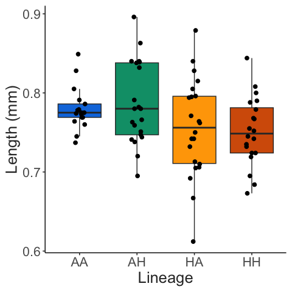
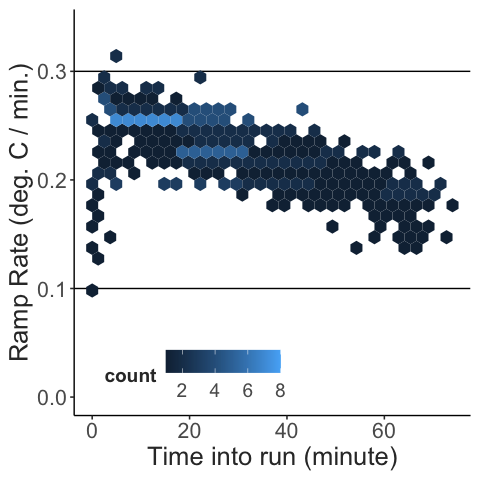

OWA Lineage CTmax Project
================
2023-03-12

- <a href="#sample-sizes" id="toc-sample-sizes">Sample sizes</a>
- <a href="#trait-measurements" id="toc-trait-measurements">Trait
  measurements</a>
  - <a href="#body-length" id="toc-body-length">Body length</a>
  - <a href="#ctmax" id="toc-ctmax">CTmax</a>
- <a href="#estimation-plots" id="toc-estimation-plots">Estimation
  Plots</a>
- <a href="#trait-correlations" id="toc-trait-correlations">Trait
  correlations</a>

# Sample sizes

This summary reports the results of 8 replicate CTmax trials. The four
lineages were sampled randomly for each replicate experiment, with one
replicate culture per lineage per run.

``` r
full_data %>% 
  count(lineage) %>% 
  knitr::kable()
```

| lineage |   n |
|:--------|----:|
| AA      |  17 |
| AH      |  21 |
| HA      |  22 |
| HH      |  20 |

# Trait measurements

## Body length

All copepods were measured after the CTmax assay. These length
measurements are shown below.

``` r
ggplot(full_data, aes(x = lineage, y = length, fill = lineage)) + 
  geom_boxplot(outlier.colour = NA) + 
  geom_point(size = 2, position = position_jitter(width = 0.1, height = 0)) + 
  scale_fill_manual(values = lineage_cols) + 
  labs(x = "Lineage", 
       y = "Length (mm)") + 
  theme_matt(base_size = 16) + 
  theme(legend.position = "none")
```



Just to note, a couple individuals appear to be on the small side, which
risks the introduction of both C6 and juvenile individuals. The smallest
individual (length \~ 0.6mm) was excluded from analyses due to the
likelihood it was not a mature individual.

After the small individual is excluded, there is no significant
difference in size across the lineages. To test this, we fit a linear
mixed effects model to the data (length \~ lineage, with a random effect
of replicate culture). Note, here and in the other models replicate
culture ID has been re-coded from 1-4, to a unique identifier (AA_1,
AA_2, AA_3, AA_4, etc.).

``` r
use_data = full_data %>% 
  filter(ctmax > 33 & length > 0.72) %>% 
  mutate(id = paste(lineage, replicate, sep = "_"))

length.model = nlme::lme(length ~ lineage, 
                        random = ~1|id, 
                        data = use_data)

kable(car::Anova(length.model))
```

|         |    Chisq |  Df | Pr(\>Chisq) |
|:--------|---------:|----:|------------:|
| lineage | 2.005465 |   3 |   0.5712733 |

## CTmax

The focal trait was the upper thermal limit, measured here as CTmax -
the critical thermal maximum. During these assays, temperature increases
at a rate of 0.1-0.3 degrees C per minute. As shown below, ramping rate
decreases linearly over time due to imperfect insulation of the water
bath reservoir. Rates are always between 0.3 and 0.1 degrees C per
minute, however, which is the range of ramping rates typically used in
copepod CTmax assays.

``` r
ramp_record2 = ramp_record %>% 
  group_by(run, minute_interval) %>% 
  summarise(mean_ramp = mean(ramp_per_minute)) %>% 
  drop_na(minute_interval, mean_ramp) 

ggplot(ramp_record2, aes(x = minute_interval, y = mean_ramp)) + 
  geom_hline(yintercept = 0.3) + 
  geom_hline(yintercept = 0.1) + 
  geom_hex(bins = 30) + 
  ylim(0,0.34) + 
  labs(y = "Ramp Rate (deg. C / min.)",
       x = "Time into run (minute)") + 
  theme_matt(base_size = 16) + 
  theme(legend.position = c(0.3, 0.1), 
        legend.direction = "horizontal")
```



Individuals are monitored until they reach their thermal limit,
indicated by a lack of responsiveness to stimuli. This is traditionally
considered an “ecological death” endpoint. Measured CTmax values are
shown below. A few anomalously low CTmax values (\<33 degrees C) were
excluded. There were 6\` total measurements excluded, in addition to the
measurement for the smallest individual, summarize below.

``` r
kable(full_data %>% 
        filter(ctmax < 33 | length < 0.65) %>% 
        count(lineage), 
      caption = "Number of individual measurements excluded from each of the lineages")
```

| lineage |   n |
|:--------|----:|
| AA      |   1 |
| AH      |   3 |
| HA      |   3 |

Number of individual measurements excluded from each of the lineages

``` r
ggplot(use_data, aes(x = lineage, y = ctmax, fill = lineage)) + 
  geom_boxplot(outlier.colour = NA) + 
  geom_point(position = position_jitter(width = 0.1, height = 0)) + 
  scale_fill_manual(values = lineage_cols) + 
  labs(x = "Lineage", 
       y = "CTmax (degrees C)") + 
  theme_matt(base_size = 16) + 
  theme(legend.position = "none")
```


To test for differences between lineages, we fit a linear mixed effects
model to the data (CTmax \~ lineage + length, with a random effect of
replicate culture). This model indicates significant difference between
lineages, as well as a significant effect of length.

``` r
ctmax.model = nlme::lme(fixed = ctmax ~ lineage + length, 
                        random = ~1|id, 
                        data = use_data)

kable(car::Anova(ctmax.model))
```

|         |     Chisq |  Df | Pr(\>Chisq) |
|:--------|----------:|----:|------------:|
| lineage | 34.369251 |   3 |   0.0000002 |
| length  |  5.090427 |   1 |   0.0240583 |

``` r

#model_resid = resid(ctmax.model, type = 'pearson')
#qqnorm(model_resid); qqline(model_resid, col = 2)
```

A posthoc test confirms that differences occur between the temperature
groups, but not between the CO2 groups - that is, copepods from the high
temperature lineages have higher CTmax values, regardless of the CO2
concentration.

``` r
kable(emmeans::emmeans(ctmax.model, pairwise~lineage)$contrasts)
```

| contrast |   estimate |        SE |  df |    t.ratio |   p.value |
|:---------|-----------:|----------:|----:|-----------:|----------:|
| AA - AH  |  0.0632684 | 0.2386491 |  12 |  0.2651105 | 0.9931279 |
| AA - HA  | -1.0886621 | 0.2516969 |  12 | -4.3252908 | 0.0047139 |
| AA - HH  | -0.8739237 | 0.2409285 |  12 | -3.6273155 | 0.0158352 |
| AH - HA  | -1.1519305 | 0.2507917 |  12 | -4.5931759 | 0.0029901 |
| AH - HH  | -0.9371920 | 0.2439369 |  12 | -3.8419449 | 0.0108787 |
| HA - HH  |  0.2147384 | 0.2572273 |  12 |  0.8348196 | 0.8370223 |

We also examined whether the individual environmental factors
(temperature or CO2 levels) affected CTmax. Here again we show that
culturing temperature appears to have a significant effect on CTmax,
while CO2 level does not. Further, there is no interaction between the
two factors, suggesting that CO2 level does not alter the effect that
temperature has on CTmax.

``` r
env.model = nlme::lme(fixed = ctmax ~ temp * co2, 
                        random = ~1|id, 
                        data = use_data)

kable(car::Anova(env.model, type = "III"))
```

|             |        Chisq |  Df | Pr(\>Chisq) |
|:------------|-------------:|----:|------------:|
| (Intercept) | 3.029277e+04 |   1 |   0.0000000 |
| temp        | 1.198340e+01 |   1 |   0.0005368 |
| co2         | 2.183734e-01 |   1 |   0.6402821 |
| temp:co2    | 1.090000e-02 |   1 |   0.9168495 |

``` r

#env.model_resid = resid(env.model, type = 'pearson')
#qqnorm(env.model_resid); qqline(env.model_resid, col = 2)
```

# Estimation Plots

Another approach we could use is to measure effect sizes, which can be
visualized using estimation plots. The disadvantage here is that
different replicates within lineages are not taken into account.
However, in this form, the observed differences between temperature
groups (rather than CO2 groups) is clear - lineages that develop at high
temperatures have higher thermal limits, regardless of the CO2 level.

``` r
ctmax_eff_sizes = use_data %>% 
  dabest(lineage, ctmax, 
         idx = c("AA", "AH", "HA", "HH"),
         paired = FALSE
         )

ctmax_mean_diff = ctmax_eff_sizes %>% mean_diff()
cohens = eff_sizes %>% cohens_d()

plot(ctmax_mean_diff, 
     rawplot.markersize = 3, 
     palette = lineage_cols,
     rawplot.ylabel = "CTmax (degrees C)")
```


``` r
size_eff_sizes = use_data %>% 
  dabest(lineage, length, 
         idx = c("AA", "AH", "HA", "HH"),
         paired = FALSE
         )

length_mean_diff = size_eff_sizes %>% mean_diff()

plot(length_mean_diff, 
     rawplot.markersize = 3, 
     palette = lineage_cols,
     rawplot.ylabel = "Length (mm)")
```


# Trait correlations

Across lineages, thermal limits tend to decrease with increasing body
size. The relationship between measured lengths and CTmax from these
assays is shown below. Note that the smaller individuals (lengths
\<0.75mm) tend to be from the HA and HH lineages. It might be worth
going back to the images to double check the stage of these individuals
to ensure only adult females were included.

``` r
full_data %>% 
  filter(ctmax > 33 & length > 0.72) %>% 
  ggplot(aes(x = length, y = ctmax)) + 
  geom_smooth(method = "lm", colour = "black") + 
  geom_point(size = 3, aes(colour = lineage)) + 
  scale_colour_manual(values = lineage_cols) + 
  labs(x = "Length (mm)", 
       y = "CTmax (degrees C)") + 
  theme_matt(base_size = 16) + 
  theme(legend.position = "bottom")
```


