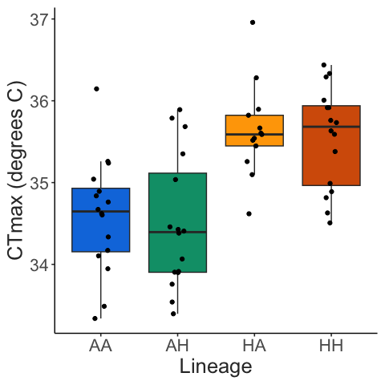

OWA Lineage CTmax Project
================
2023-01-10

- <a href="#sample-sizes" id="toc-sample-sizes">Sample sizes</a>
- <a href="#trait-measurements" id="toc-trait-measurements">Trait
  measurements</a>
  - <a href="#body-length" id="toc-body-length">Body length</a>
  - <a href="#ctmax" id="toc-ctmax">CTmax</a>
- <a href="#trait-correlations" id="toc-trait-correlations">Trait
  correlations</a>

# Sample sizes

This summary reports the results of 4 replicate CTmax trials. The four
lineages were sampled randomly for each replicate experiment, with one
replicate culture per lineage per run.

``` r
full_data %>% 
  count(lineage) %>% 
  knitr::kable()
```

| lineage |   n |
|:--------|----:|
| AA      |  11 |
| AH      |   8 |
| HA      |  13 |
| HH      |   8 |

# Trait measurements

## Body length

All copepods were measured after the CTmax assay. These length
measurements are shown below.

``` r
ggplot(full_data, aes(x = lineage, y = length, fill = lineage)) + 
  geom_boxplot(outlier.colour = NA) + 
  geom_point(size = 2, position = position_jitter(width = 0.1, height = 0)) + 
  scale_fill_manual(values = lineage_cols) + 
  labs(x = "Lineage", 
       y = "Length (mm)") + 
  theme_matt(base_size = 16) + 
  theme(legend.position = "none")
```


## CTmax

The focal trait was the thermal limit, measured here as CTmax - the
critical thermal maximum. During these assays, temperature increases at
a rate of 0.1-0.3 degrees C per minute. As shown below, ramping rate
decreases linearly over time due to imperfect insulation of the water
bath reservoir. Rates are always between 0.3 and 0.1 degrees C per
minute, however, which is the range of ramping rates typically used in
copepod CTmax assays.

``` r
ramp_record2 = ramp_record %>% 
  group_by(run, minute_interval) %>% 
  summarise(mean_ramp = mean(ramp_per_minute)) %>% 
  drop_na(minute_interval, mean_ramp) 

ggplot(ramp_record2, aes(x = minute_interval, y = mean_ramp)) + 
  geom_hline(yintercept = 0.3) + 
  geom_hline(yintercept = 0.1) + 
  #geom_point() + 
  geom_hex(bins = 30) + 
  #scale_fill_continuous(lim=c(2,25), na.value=NA) + 
  #ylim(0,0.32) + 
  labs(y = "Ramp Rate (deg. C / min.)",
       x = "Time into run (minute)") + 
  theme_matt(base_size = 16) + 
  theme(legend.position = c(0.3, 0.1), 
        legend.direction = "horizontal")
```


Individuals are monitored until they reach their thermal limit,
indicated by a lack of responsiveness to stimuli. This is traditionally
considered an “ecological death” endpoint. Measured CTmax values are
shown below.

``` r
ggplot(full_data, aes(x = lineage, y = ctmax, fill = lineage)) + 
  geom_boxplot(outlier.colour = NA) + 
  geom_point(position = position_jitter(width = 0.1, height = 0)) + 
  scale_fill_manual(values = lineage_cols) + 
  labs(x = "Lineage", 
       y = "CTmax (degrees C)") + 
  theme_matt(base_size = 16) + 
  theme(legend.position = "none")
```



# Trait correlations

Across species, thermal limits tend to decrease with increasing body
size. The relationship between measured lengths and CTmax from these
assays is shown below.

``` r
ggplot(full_data, aes(x = length, y = ctmax)) + 
  geom_smooth(method = "lm", colour = "black") + 
  geom_point(size = 3, aes(colour = lineage)) + 
  scale_colour_manual(values = lineage_cols) + 
  labs(x = "Length (mm)", 
       y = "CTmax (degrees C)") + 
  theme_matt(base_size = 16) + 
  theme(legend.position = "bottom")
```


