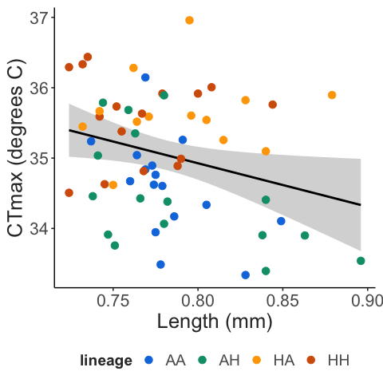

OWA Lineage CTmax Project
================
2022-12-13

-   <a href="#sample-sizes" id="toc-sample-sizes">Sample sizes</a>
-   <a href="#trait-measurements" id="toc-trait-measurements">Trait
    measurements</a>
    -   <a href="#body-length" id="toc-body-length">Body length</a>
    -   <a href="#ctmax" id="toc-ctmax">CTmax</a>
-   <a href="#trait-correlations" id="toc-trait-correlations">Trait
    correlations</a>

# Sample sizes

This summary reports the results of 1 replicate CTmax trials. The four
lineages were sampled randomly for each replicate experiment, with one
replicate culture per lineage per run.

| lineage |   n |
|:--------|----:|
| AA      |   7 |
| AH      |   7 |
| HA      |   9 |
| HH      |   7 |

# Trait measurements

## Body length

All copepods were measured after the CTmax assay. These length
measurements are shown below.

## CTmax

The focal trait was the thermal limit, measured here as CTmax - the
critical thermal maximum. During these assays, temperature increases at
a rate of 0.1-0.3 degrees C per minute. As shown below, ramping rate
decreases linearly over time due to imperfect insulation of the water
bath reservoir. Rates are always between 0.3 and 0.1 degrees C per
minute, however, which is the range of ramping rates typically used in
copepod CTmax assays.

Individuals are monitored until they reach their thermal limit,
indicated by a lack of responsiveness to stimuli. This is traditionally
considered an “ecological death” endpoint. Measured CTmax values are
shown below.

# Trait correlations

Across species, thermal limits tend to decrease with increasing body
size. The relationship between measured lengths and CTmax from these
assays is shown below.

