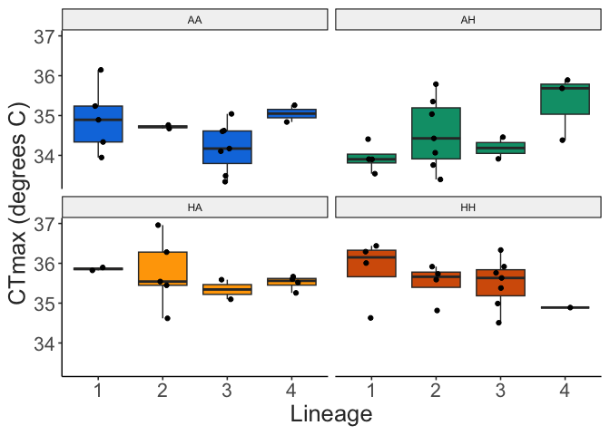

OWA Lineage CTmax Project
================
2023-02-05

- <a href="#sample-sizes" id="toc-sample-sizes">Sample sizes</a>
- <a href="#trait-measurements" id="toc-trait-measurements">Trait
  measurements</a>
  - <a href="#body-length" id="toc-body-length">Body length</a>
  - <a href="#ctmax" id="toc-ctmax">CTmax</a>
- <a href="#estimation-plots" id="toc-estimation-plots">Estimation
  Plots</a>
- <a href="#trait-correlations" id="toc-trait-correlations">Trait
  correlations</a>

# Sample sizes

This summary reports the results of 8 replicate CTmax trials. The four
lineages were sampled randomly for each replicate experiment, with one
replicate culture per lineage per run.

``` r
full_data %>% 
  count(lineage) %>% 
  knitr::kable()
```

| lineage |   n |
|:--------|----:|
| AA      |  17 |
| AH      |  21 |
| HA      |  22 |
| HH      |  20 |

# Trait measurements

## Body length

All copepods were measured after the CTmax assay. These length
measurements are shown below.

``` r
ggplot(full_data, aes(x = lineage, y = length, fill = lineage)) + 
  geom_boxplot(outlier.colour = NA) + 
  geom_point(size = 2, position = position_jitter(width = 0.1, height = 0)) + 
  scale_fill_manual(values = lineage_cols) + 
  labs(x = "Lineage", 
       y = "Length (mm)") + 
  theme_matt(base_size = 16) + 
  theme(legend.position = "none")
```


Just to note, a couple individuals appear to be on the small side, which
risks the introduction of both C6 and juvenile individuals.

## CTmax

The focal trait was the upper thermal limit, measured here as CTmax -
the critical thermal maximum. During these assays, temperature increases
at a rate of 0.1-0.3 degrees C per minute. As shown below, ramping rate
decreases linearly over time due to imperfect insulation of the water
bath reservoir. Rates are always between 0.3 and 0.1 degrees C per
minute, however, which is the range of ramping rates typically used in
copepod CTmax assays.

``` r
ramp_record2 = ramp_record %>% 
  group_by(run, minute_interval) %>% 
  summarise(mean_ramp = mean(ramp_per_minute)) %>% 
  drop_na(minute_interval, mean_ramp) 

ggplot(ramp_record2, aes(x = minute_interval, y = mean_ramp)) + 
  geom_hline(yintercept = 0.3) + 
  geom_hline(yintercept = 0.1) + 
  geom_hex(bins = 30) + 
  ylim(0,0.34) + 
  labs(y = "Ramp Rate (deg. C / min.)",
       x = "Time into run (minute)") + 
  theme_matt(base_size = 16) + 
  theme(legend.position = c(0.3, 0.1), 
        legend.direction = "horizontal")
```


Individuals are monitored until they reach their thermal limit,
indicated by a lack of responsiveness to stimuli. This is traditionally
considered an “ecological death” endpoint. Measured CTmax values are
shown below. A few anomalously low CTmax values (\<33 degrees C) were
excluded. There were 6\` total measurements excluded, summarize below.

``` r
kable(full_data %>% 
        filter(ctmax < 33) %>% 
        count(lineage), 
      caption = "Number of individual measurements excluded from each of the lineages")
```

| lineage |   n |
|:--------|----:|
| AA      |   1 |
| AH      |   3 |
| HA      |   2 |

Number of individual measurements excluded from each of the lineages

``` r
full_data %>% 
  #filter(length > 0.72) %>% 
  filter(ctmax > 33) %>% 
  ggplot(aes(x = lineage, y = ctmax, fill = lineage)) + 
  geom_boxplot(outlier.colour = NA) + 
  geom_point(position = position_jitter(width = 0.1, height = 0)) + 
  scale_fill_manual(values = lineage_cols) + 
  labs(x = "Lineage", 
       y = "CTmax (degrees C)") + 
  theme_matt(base_size = 16) + 
  theme(legend.position = "none")
```


To test for differences between lineages, we fit a linear mixed effects
model to the data (CTmax \~ lineage + length, with a nested random
effect of replicate within lineage). There’s currently no significant
difference between lineages, but there is a significant effect of
length. We still need to do a posthoc test to examine pairwise
differences between lineages.

``` r
ctmax.model = nlme::lme(ctmax ~ lineage + length, 
                        random = ~1|lineage/replicate, 
                        data = filter(full_data, ctmax > 33))

kable(car::Anova(ctmax.model))
```

|         |    Chisq |  Df | Pr(\>Chisq) |
|:--------|---------:|----:|------------:|
| lineage | 5.910100 |   3 |   0.1160669 |
| length  | 9.590888 |   1 |   0.0019555 |

``` r

#model_resid = resid(ctmax.model, type = 'pearson')
#qqnorm(model_resid); qqline(model_resid, col = 2)
```

We also examined whether the individual environmental factors
(temperature or CO2 levels) affected CTmax. Culturing temperature
appears to have a significant effect on CTmax, while CO2 level does not.
Further, there is no interaction between the two factors, suggesting
that CO2 level does not alter the effect that temperature has on CTmax.

``` r
env.model = nlme::lme(ctmax ~ temp * co2, 
                        random = ~1|lineage/replicate, 
                        data = filter(full_data, ctmax > 33))

kable(car::Anova(env.model, type = "III"))
```

|             |        Chisq |  Df | Pr(\>Chisq) |
|:------------|-------------:|----:|------------:|
| (Intercept) | 5226.5137842 |   1 |   0.0000000 |
| temp        |    3.3992075 |   1 |   0.0652277 |
| co2         |    0.0344067 |   1 |   0.8528443 |
| temp:co2    |    0.0115227 |   1 |   0.9145161 |

``` r

#env.model_resid = resid(env.model, type = 'pearson')
#qqnorm(env.model_resid); qqline(env.model_resid, col = 2)
```

# Estimation Plots

Another approach we could use is to measure effect sizes, which can be
visualized using estimation plots. The disadvantage here is that
different replicates within lineages are not taken into account.
However, in this form, the observed differences between temperature
groups (rather than CO2 groups) is clear - lineages that develop at high
temperatures have higher thermal limits, regardless of the CO2 level.

``` r
eff_sizes = full_data %>% 
  filter(ctmax > 33) %>% 
  dabest(lineage, ctmax, 
         idx = c("AA", "AH", "HA", "HH"),
         paired = FALSE
         )

mean_diff = eff_sizes %>% mean_diff()

plot(mean_diff, 
     rawplot.markersize = 3, 
     palette = lineage_cols,
     rawplot.ylabel = "CTmax (degrees C)")
```



# Trait correlations

Across lineages, thermal limits tend to decrease with increasing body
size. The relationship between measured lengths and CTmax from these
assays is shown below. Note that the smaller individuals (lengths
\<0.75mm) tend to be from the HA and HH lineages. It might be worth
going back to the images to double check the stage of these individuals
to ensure only adult females were included.

``` r
full_data %>% 
  filter(ctmax > 33) %>% 
  ggplot(aes(x = length, y = ctmax)) + 
  geom_smooth(method = "lm", colour = "black") + 
  geom_point(size = 3, aes(colour = lineage)) + 
  scale_colour_manual(values = lineage_cols) + 
  labs(x = "Length (mm)", 
       y = "CTmax (degrees C)") + 
  theme_matt(base_size = 16) + 
  theme(legend.position = "bottom")
```


